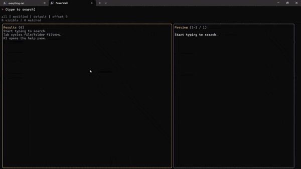

# Everything.Net

[](https://www.nuget.org/packages/Voidtools.Everything.Net/)

Typed .NET wrapper for the voidtools Everything SDK.



NuGet package: `Voidtools.Everything.Net`

Supported target frameworks:

- `net8.0`
- `net10.0`

## Supported architectures

- Windows x64 via `Everything64.dll`
- Windows ARM64 via `EverythingARM64.dll`

## Requirements

- Windows
- Everything installed and running
- Matching native SDK DLL deployed with your app or packaged through `runtimes/.../native`

## Registration

```csharp
using Everything.Net.DependencyInjection;
using Microsoft.Extensions.DependencyInjection;

var services = new ServiceCollection();

services.AddEverythingClient(options =>
{
    options.DefaultMaxResults = 200;
    options.ThrowOnUnavailableClient = true;
});
```

## Usage

```csharp
using Everything.Net.Abstractions;
using Everything.Net.Enums;
using Everything.Net.Models;
using Microsoft.Extensions.DependencyInjection;

var provider = services.BuildServiceProvider();
var client = provider.GetRequiredService<IEverythingClient>();

var response = await client.SearchAsync(new EverythingQuery
{
    SearchText = "invoice dm:today",
    MaxResults = 50,
    WaitForResults = true,
    Sort = EverythingSort.DateModifiedDescending,
    RequestFlags =
        EverythingRequestFlags.FileName |
        EverythingRequestFlags.Path |
        EverythingRequestFlags.Size |
        EverythingRequestFlags.DateModified
});

foreach (var item in response.Results)
{
    Console.WriteLine($"{item.FullPath} ({item.Size})");
}
```

## Native DLL packaging

The NuGet package includes the native Everything SDK DLLs as runtime assets:

- `runtimes/win-x64/native/Everything64.dll`
- `runtimes/win-arm64/native/EverythingARM64.dll`
